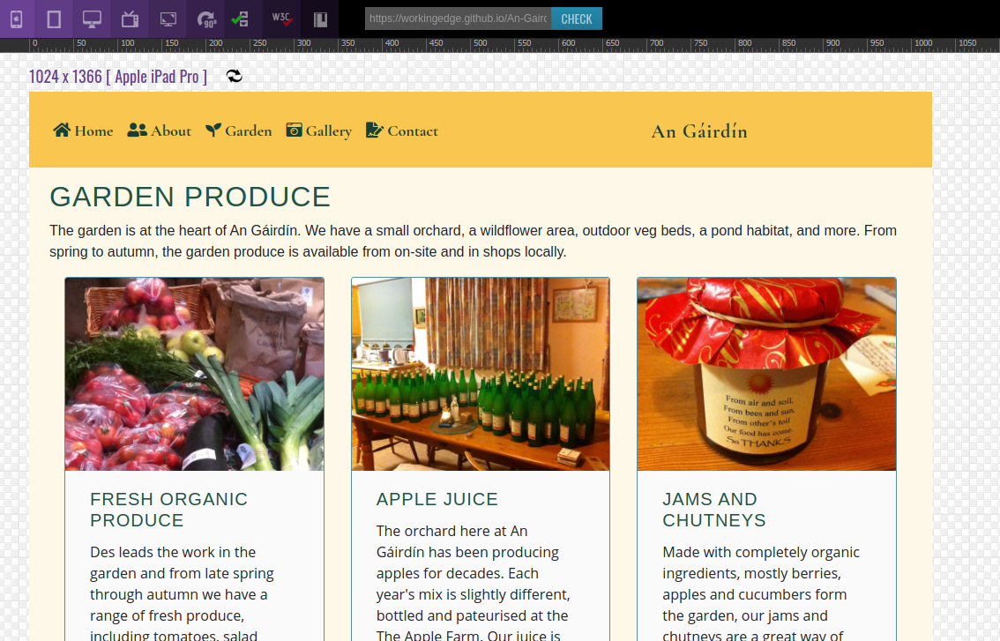

# Testing An Gáirdín

## Process, Issues, Resolutions
The live site and the source code have both undergone testing. Issues found and the actions taken to resolve the issues are described below.

### Test Layout and Appearance on Different Physical Devices
The appearance and general functionality of the site were tested on a variety of device/browser combinations, as follows:
* Chrome, Firefox and Opera on Linux - Done with Dell XPS running Ubuntu 16.04, result - ok
* Edge and IE on Windows - Done with Dell Latitiude E6440 running Windows 10, result - ok
* Chrome and Safari on Mac - Done with 2012 MacBook Pro running Mojave, result - ok
* Chrome and DuckDuckGo on Android - Done with Motorola Moto G7, result - ok 
* Safari on iPhone - Done with iPhone 6, result - ok

### Test Internal Links
Checked that all internal site links work as expected on all pages. 

### Check overall look and feel of the site, ease of navigation, clarity of purpose etc.
Reviewed the site against stated goals and user stories - there is of course room for improvement, but in general, the goals are met:
* Site is easy to navigate and learn
* Site clearly gives an impression of the project goals and activities
* Site is welcoming and straightforward

### Test Appearance on Different Device sizes
The appearance of the site on different devices was checked virtually using the following sites:
* [Responsinator](https://www.responsinator.com/)
* [Google Mobile-Friendly Test](https://search.google.com/test/mobile-friendly?id=mIL9sVD5nQCR2mLTbFnEUg)
* [Website Responsive Testing Tool](http://responsivetesttool.com/)

##### Test Issue and Resolution - Text Overflow
Using the repsonsive testing tool it was apparent that there was an overflow issue with heading texts in the bootstrap cards on the garden.html page. The headings affected were long, single words (Biodiversity and Permaculture) that could not break like the muli-word headings. This issue was fixed using a media query based on a range between 576 px (below which the cards switched to a single col layout and were fine) and 768 (above which the cols were wide enough to accommodate the exisintg text).
Media queries are based on the bootstrap documentation [here](https://getbootstrap.com/docs/4.0/layout/overview/): 
// Small devices (landscape phones, 576px and up)
@media (min-width: 576px) and (max-width: 767.98px) { ... }

##### Test Issue and Resolution - Browser Tab Info
During testing, I noticed the text in the browser tab was not correct for all pages. This was due using one of the site's html pages as a template for another.
Issue fixed by updating the 'title' element in the head section of each of the page's HTML. 

##### Test Issue and Resolution - Header
Visual testing of the site showed a few issues with the header at different device sizes - for example, when the gallery page was added, there was insifficient room for all itenms in the expanded nav bar in the grid column.
Issues with the header appearance were fixed by adjusting the allocation of columns between the left and right (it started as 6 and 6 but then the allocation for the logo/right was reduced. Reduction of margins and padding arround nav-items and a reduction of the spacing between letters also helped to fix this issue.)

### CSS
https://jigsaw.w3.org/css-validator/
The CSS was tested at several points during development. Minor issues such as a ':' in place of a ';' or a missing '}' were found.
These have been fixed and the CSS has been run through [auto-prefixer](https://autoprefixer.github.io/) - no errors found (as of 23/11/20).
However, there are warnings - these relate to imported stylesheets and unknown vendor prefixes. Seems safe to ignore these:
https://www.sitepoint.com/community/t/css-validation-unknown-vendor-extensions/125616

### HTML
HTML was checked using the [W3C Markup Validation Service](https://validator.w3.org/).
In initial tests, the following issues were found and resolved:

##### Test issue and Resolution - aria-controls
The W3C HTML checker shows an error that the aria-controls attribute is not pointing to an element in the same document. 
Verfified that the check I'm using is [appplicable for ARIA - yes](https://w3c.github.io/using-aria/#validation) 
Issue was reolved by removing the hash '#' before the ID, in contrast to the data-target attribute (which has the # for ID).

##### Test Issue and Resolution - type attribute for <textarea>
The checker showed an error where I had included "type=text" for the textarea in the contact form.
After checking https://www.w3schools.com/tags/tag_textarea.asp and https://www.w3schools.com/tags/att_input_type.asp - I have verified this is an incorrect use of the type attribute and have therefore removed it.
Tested for any impact on functionality of the textarea - none.

As of 23/11/20, test results for each page in the W3C validation service show no errors or warnings: "Document checking completed. No errors or warnings to show."

### Test mobility
https://search.google.com/test/mobile-friendly
* Tested 17 Novemeber, 2020
* Result: Page is mobile friendly

### Test contrast
https://color.a11y.com/

Initial contrast test showed insufficient contrast for the text used in the circle overlay on home page - this has been fixed (increased font size and changed colour).

The test still shows insufficient contrast for the copyright info on the footer. I have assessed this visually and in light of the fact that the text is intended to be 'small print' and have decided to keep the footer colour. This decision is based on the purpose of the content (copyright info only), visual assessment of the page, consideration of the overall look and feel of the site, and is also part-inspired by the information here: https://uxmovement.com/buttons/the-myths-of-color-contrast-accessibility/

### Test Cross-Browser
For virtual cross-browser testing I used the following service (using a free 7-day trial)
https://app.crossbrowsertesting.com/public/i04a6e9c0e8a8600/screenshots/z2aa92594c65a69493d6

##### Test Issue and Resolution - rel="noreferrer"
Action item (done) from this test was to include rel="noopener" or rel="noreferrer" to external links
Resource: https://web.dev/external-anchors-use-rel-noopener/

### Other Issues
Other issues were found and resolved during development - these are described in the issues overcome section of the Readme.

[Back to Readme](README.md).
